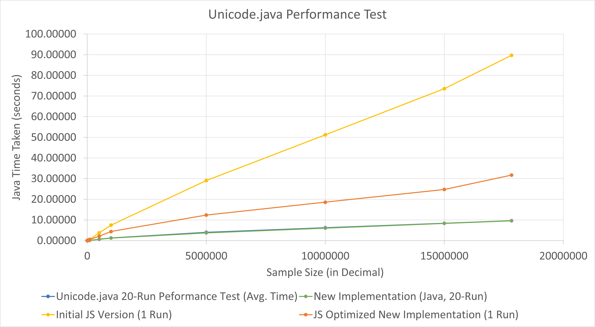

# CSARCH2_Project (Java Build)
Simulation Project
Topic: Unicode

The goal of the project is to create an application that is capable of turning a Unicode value into its equivalent UTF-8, UTF-16, and UTF-32 value.

## Group 7
1. Alon-alon, Jason Miguel
2. Cruz, Julianne Felice
3. De Guzman, Cyril Ethan
4. Escalona, Jose Miguel
5. Rebong, Leana Hyacinth
6. Roncal, Raphael
7. Turk, Chadi

## Description
1. Java Implementation of the Project
2. Contains the basic required functionality of checking and saving inputted values and its respective UTF values.
3. Implemented using default and built-in Java AWT and Javax Swing libraries.

## Inputs:
1. Unicode value whether as proper format or not.
2. Input values tested: "245D6","1CAFE","42069","Youtube"(INVALID),"Meta"(INVALID),"ABCDEF","10FFFFF","1FFFFF",""(INVALID),"U+ABCDEF","0x12345","U+0x12345","12345";
3. Added option for multiple inputs when entered with ',' as separating value.

## Outputs:
1. Uses in part CSV format in display, and in whole in file.
2. Fill will either be in a Text or CSV file format containing: Input Unicode, UTF-8, UTF-16, UTF-32, Character.

## Easter Egg:
Given the correct keyword on the input on the Unicode entry, the system may automatically run through all increments of a given Unicode value from its start to end values.

## References:
**Java**
1. Previous MP code in CCPROG3 (For GUI and Control)
2. Long - https://docs.oracle.com/javase/7/docs/api/java/lang/Long.html
3. Character - https://docs.oracle.com/javase/8/docs/api/java/lang/Character.html (Prefer to use when converting a characer directly instead of its Unicode value.)
4. JFileChooser - https://docs.oracle.com/javase/7/docs/api/javax/swing/JFileChooser.html
5. Writing to File - https://www.tutorialkart.com/java/java-write-string-to-file/
6. Using JScrollPane - https://stackoverflow.com/questions/10177183/add-scroll-into-text-area

## Performance

Note that 70-Run was executed with other applications running in the background, thus it may have affected the performance in comparison to 20-Run which was executed on a newly booted system.
